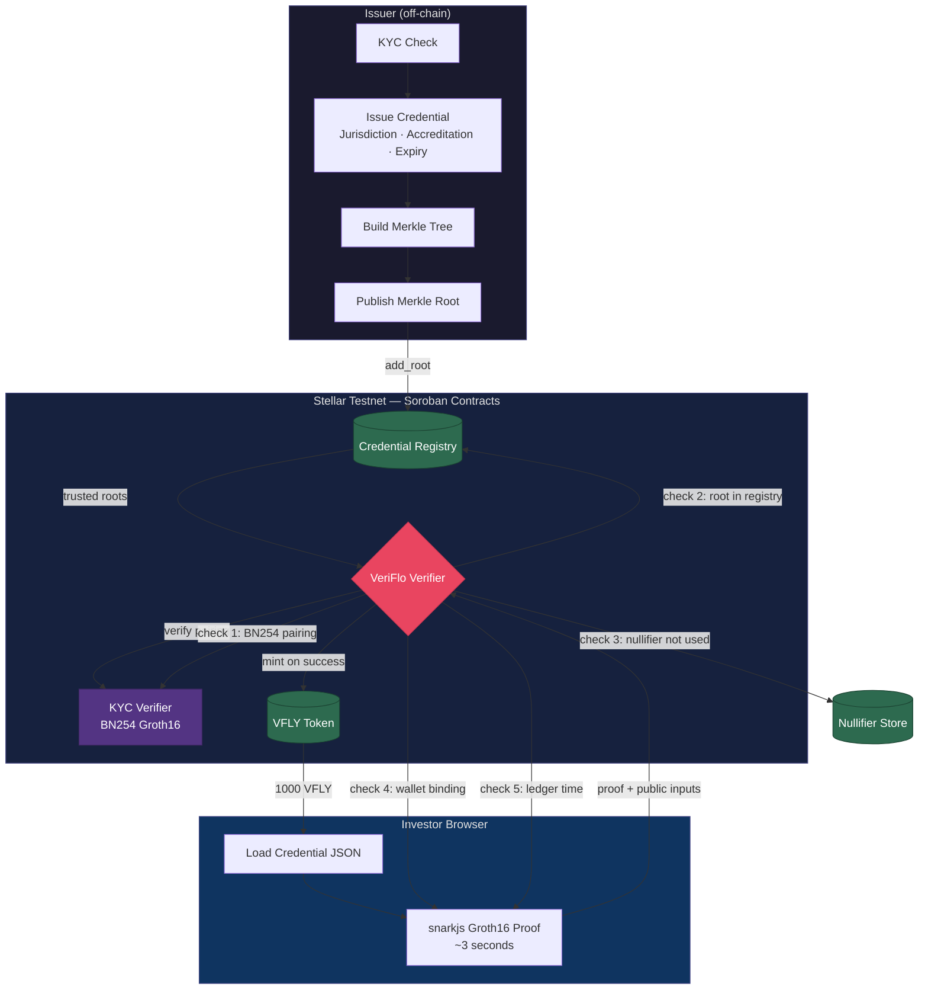
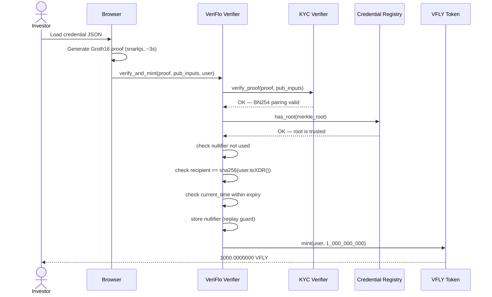
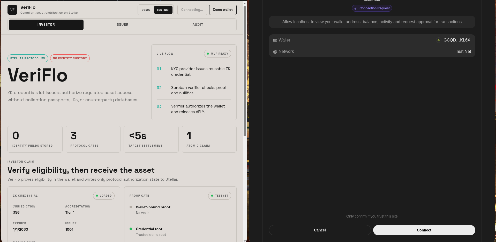
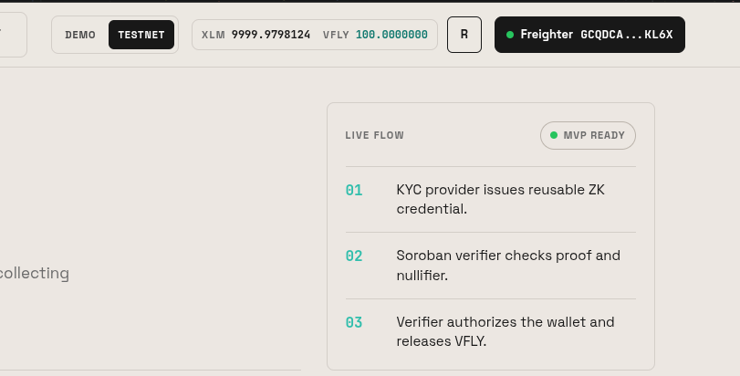
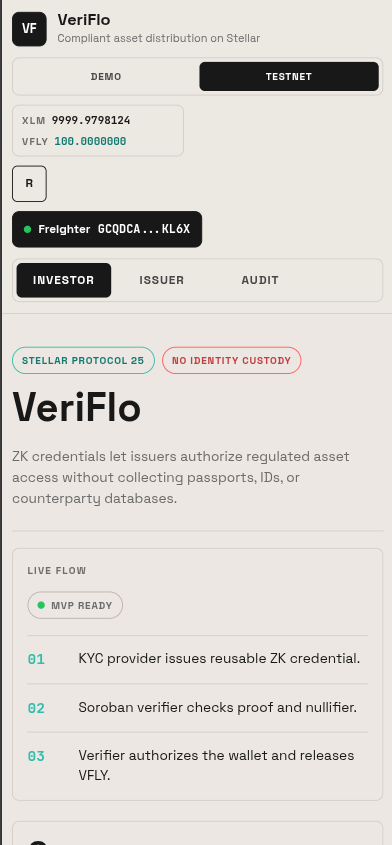
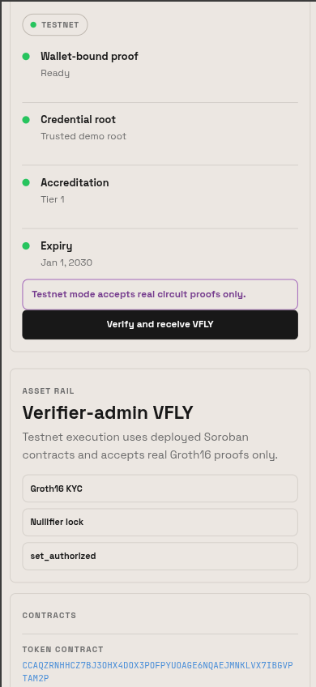
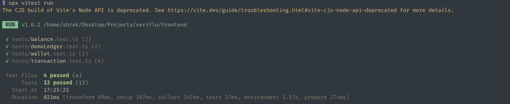

# VeriFlo

[](https://github.com/NevroHelios/VeriFlo/actions/workflows/ci.yml)

Compliant asset distribution on Stellar with reusable zero-knowledge eligibility credentials.

VeriFlo lets an issuer verify investor eligibility **without** collecting or storing identity documents. A KYC provider issues a portable Merkle credential, the investor generates a wallet-bound Groth16 proof entirely in the browser, and four Soroban contracts enforce nullifier replay protection and VFLY authorization on-chain.

---

## Live Demo

> **[https://veri-flo.vercel.app/](https://veri-flo.vercel.app/)**

---

<!-- ## Demo Video

> to be added -->

---

## Table of Contents

1. [Architecture](#architecture)
2. [Deployed Contracts](#deployed-contracts)
3. [Screenshots](#screenshots)
4. [Quick Demo](#quick-demo)
5. [Project Structure](#project-structure)
6. [Local Development](#local-development)
7. [Issuer Tooling](#issuer-tooling)
8. [Testnet Setup](#testnet-setup)
9. [Deploy Contracts](#deploy-contracts)
10. [Testing](#testing)
11. [Execution Modes](#execution-modes)

---

## Architecture

### Data Flow



### Contract Interaction



**Public input layout** (must match circuit output order):

| Index | Field | Description |
|-------|-------|-------------|
| 0 | `nullifier` | Poseidon(nonce, recipient) — prevents replay |
| 1 | `merkle_root` | Commitment tree root, verified against registry |
| 2 | `min_accreditation` | Minimum tier required (circuit-enforced) |
| 3 | `current_time` | Unix seconds at proof time (circuit-enforced expiry) |
| 4 | `recipient` | sha256(Address.toXDR())[0..31] — wallet binding |

**Design decisions:**
- The proof is generated client-side — the verifier never sees raw PII.
- Nullifiers are stored on-ledger, so the same credential cannot claim twice.
- Merkle roots are published by the issuer to the Credential Registry; revoking a root invalidates all credentials under it without touching user data.
- Storage TTLs are bumped on every write (~30-day lifetime, extend when < 1/5 remains) so contract state survives across ledger periods.

---

## Deployed Contracts (Stellar Testnet)

| Contract | Address |
|---|---|
| VFLY Token | [`CCAQZRNHHCZ7BJ3OHX4DOX3POFPYUOAGE6NQAEJMNKLVX7IBGVPTAM2P`](https://stellar.expert/explorer/testnet/contract/CCAQZRNHHCZ7BJ3OHX4DOX3POFPYUOAGE6NQAEJMNKLVX7IBGVPTAM2P) |
| KYC Verifier (Groth16) | [`CDQ56VSVYUOFIGNBLZSBEQ7ZJL4WVKSJ7RILJNULN4564B4OBZVKWISW`](https://stellar.expert/explorer/testnet/contract/CDQ56VSVYUOFIGNBLZSBEQ7ZJL4WVKSJ7RILJNULN4564B4OBZVKWISW) |
| VeriFlo Verifier | [`CDGGIZWLIC6SWP2WFCENCB5XWJIJVEQLAU3ZX2OL7N6BCMVVEV5ECAV6`](https://stellar.expert/explorer/testnet/contract/CDGGIZWLIC6SWP2WFCENCB5XWJIJVEQLAU3ZX2OL7N6BCMVVEV5ECAV6) |
| Credential Registry | [`CATEWNQ53QS2RLGXDK2MN2F55OIUXSUQCLVUNJ5RX3LCIRFRIQCML6AJ`](https://stellar.expert/explorer/testnet/contract/CATEWNQ53QS2RLGXDK2MN2F55OIUXSUQCLVUNJ5RX3LCIRFRIQCML6AJ) |

**Sample contract invocation transaction:**
[`92e722f5b47ad58b5787b158d7a3a0848eab42ba594cfb6a0325b958d62f6afd`](https://stellar.expert/explorer/testnet/tx/92e722f5b47ad58b5787b158d7a3a0848eab42ba594cfb6a0325b958d62f6afd)
*(add_trusted_root call to the VeriFlo Verifier contract)*

All four contracts are deployed and initialized on testnet. A Merkle root is pre-registered on the verifier. Issue credentials with the scripts in `scripts/issuer/` and switch the app to Testnet mode to submit real ZK proofs.

---

## Screenshots

### Wallet connection



### Wallet connected with balance



### Successful testnet transaction

> *[Screenshot — to be added]*

### Mobile responsive view

<p>
  
  &nbsp;
  
</p>

### CI pipeline

> *[Screenshot — to be added after push]*

### Test output



---

## Quick Demo (Demo Mode — no wallet required)

```bash
cd frontend
npm install
npm run dev
```

Open `http://localhost:3000`, leave the mode switch on **Demo**, then:

1. Click **Demo wallet** (creates an ephemeral in-memory wallet)
2. Go to **Issuer** → **Generate demo credential** → **Save to wallet**
3. Go to **Investor** → **Verify and receive VFLY**
4. Go to **Audit** to see the compliance event stream

Expected result:
- Wallet shows `1000.0000000 VFLY`
- Audit stream records the proof release event
- A second claim attempt is **rejected** (nullifier replay)

No circuit files are required for Demo mode — a deterministic mock proof is used. A warning banner appears in Testnet mode if `kyc_eligibility.wasm` / `.zkey` are missing.

---

## Project Structure

```
veriflo/
├── circuits/
│   └── build/                     # Compiled Groth16 circuit artifacts (wasm + zkey)
├── contracts/
│   ├── credential-registry/       # Issuer Merkle root registry
│   ├── kyc-verifier/              # Soroban BN254 Groth16 pairing verifier
│   ├── veriflo-verifier/          # Core: root + nullifier + wallet binding + time + mint
│   └── vfly-token/                # Authorization-gated token
├── frontend/
│   ├── app/                       # Next.js App Router pages
│   ├── components/                # React components (AppShell, panels, wallet)
│   ├── hooks/                     # useWallet, useBalance
│   ├── lib/
│   │   └── zk.ts                  # snarkjs proof generation + circuit file check
│   └── constants.ts               # Contract addresses, mint amount, env vars
├── scripts/
│   ├── deploy.sh                  # Build + deploy + initialize all four contracts
│   ├── test-e2e.js                # End-to-end ZK integration test (real proof → testnet)
│   └── issuer/                    # Issuer CLI: keypair, credential, Merkle tree, registry
└── Cargo.toml                     # Rust workspace
```

---

## Local Development

```bash
cd frontend
npm install
npm run dev        # copies circuit files then starts Next.js
```

Open `http://localhost:3000`. The app starts in **Demo** mode by default.

### Circuit files (Testnet mode only)

Real ZK proof generation requires:

```
frontend/public/circuits/kyc_eligibility.wasm
frontend/public/circuits/kyc_eligibility.zkey
```

`npm run dev` copies these from `circuits/build/` automatically. If they are missing and you switch to Testnet mode, a warning banner appears. Demo mode works without them.

---

## Issuer Tooling

```bash
cd scripts/issuer
npm install

# 1. Generate an issuer keypair (gitignored)
node generate-keypair.js

# 2. Issue a credential for a wallet address
node issue-credential.js \
  --address G... \
  --jurisdiction 356 \
  --accreditation 1 \
  --expiry 1893456000

# 3. Build the Merkle tree from all issued credentials
node build-merkle-tree.js

# 4. Publish the Merkle root to the on-chain registry
REGISTRY_CONTRACT=CATE... ADMIN_SECRET=S... node update-registry.js
```

`issuer-keypair.json`, `credential-*.json`, `wallet-credential-*.json`, `merkle-proof-*.json`, and `merkle-tree.json` are gitignored — never commit them.

One-step shortcut:

```bash
./scripts/issuer/issue-and-register.sh G... 356 1 1893456000
```

---

## Testnet Demo Flow

Prerequisites: [Freighter wallet](https://www.freighter.app/) installed in your browser, funded with testnet XLM via [Friendbot](https://laboratory.stellar.org/#account-creator?network=test).

```bash
cd frontend && npm run dev
# Open http://localhost:3000
```

1. Top-right toggle → **Testnet**
2. Click **Connect Freighter** → approve in the extension
3. Go to **Investor** → **Load credential from file**
4. Select your `wallet-credential-<ADDRESS>.json` from `scripts/issuer/`
5. Click **Verify and receive VFLY** — proof generates (~3 s), submits to chain
6. Balance updates to `1000.0000000 VFLY`
7. Click again → rejected (nullifier replay)
8. **Audit** tab → on-chain proof release event visible

If you need a credential for your address:

```bash
cd scripts/issuer
node issue-credential.js --address <YOUR_FREIGHTER_G...> --jurisdiction 356 --accreditation 1 --expiry 1893456000
node build-merkle-tree.js
REGISTRY_CONTRACT=CATEWNQ53QS2RLGXDK2MN2F55OIUXSUQCLVUNJ5RX3LCIRFRIQCML6AJ \
ADMIN_SECRET=S... node update-registry.js
```

---

## Testnet Setup

```bash
cp frontend/.env.local.example frontend/.env.local
```

Fill in contract addresses (already deployed — copy from the table above):

```bash
NEXT_PUBLIC_TOKEN_CONTRACT=CCAQZRNHHCZ7BJ3OHX4DOX3POFPYUOAGE6NQAEJMNKLVX7IBGVPTAM2P
NEXT_PUBLIC_KYC_VERIFIER_CONTRACT=CDQ56VSVYUOFIGNBLZSBEQ7ZJL4WVKSJ7RILJNULN4564B4OBZVKWISW
NEXT_PUBLIC_VERIFIER_CONTRACT=CDGGIZWLIC6SWP2WFCENCB5XWJIJVEQLAU3ZX2OL7N6BCMVVEV5ECAV6
NEXT_PUBLIC_REGISTRY_CONTRACT=CATEWNQ53QS2RLGXDK2MN2F55OIUXSUQCLVUNJ5RX3LCIRFRIQCML6AJ

ENABLE_TESTNET_FUNDER=false
```

Never prefix secrets with `NEXT_PUBLIC_`. Never commit `.env.local`.

---

## Deploy Contracts

```bash
SOURCE=deployer TRUSTED_ROOT_HEX=<32-byte-hex> ./scripts/deploy.sh
```

Builds and deploys all four contracts, then initializes them in order: VFLY Token → KYC Verifier → VeriFlo Verifier → Credential Registry. If `TRUSTED_ROOT_HEX` is omitted, call `add_trusted_root` manually afterward.

---

## Vercel Deployment

1. Import the GitHub repo at [vercel.com/new](https://vercel.com/new)
2. Set **Root Directory** to `frontend`
3. Add environment variables (all four `NEXT_PUBLIC_*` contract addresses above; `ENABLE_TESTNET_FUNDER=false`)
4. Deploy — the build copies circuit artifacts automatically

---

## Testing

### Contract unit tests

```bash
cargo test --workspace      # 22 tests across all contracts
```

Snapshots are stored in `test_snapshots/` alongside each contract and committed for regression detection.

### Frontend type check and unit tests

```bash
cd frontend
npm run build               # type check + production build
npx vitest run              # 9 vitest tests (wallet, balance, transaction)
```

### End-to-end ZK integration test

Generates a real Groth16 proof, verifies off-chain with snarkjs, then submits to the deployed testnet verifier:

```bash
VERIFIER_CONTRACT=CDGG... TEST_SECRET=S... node scripts/test-e2e.js
```

Requires circuit artifacts in `circuits/build/`.

---

## Execution Modes

| Mode | Proof type | Contracts | Use case |
|------|-----------|-----------|----------|
| **Demo** | Deterministic mock bytes | In-memory simulation | Browser demo, no wallet needed |
| **Testnet** | Real snarkjs Groth16 | Deployed Soroban contracts | Integration testing, live demo |

Toggle in the top-right corner. Testnet mode rejects demo proof bytes at the contract level. Mode is persisted in `localStorage`.
